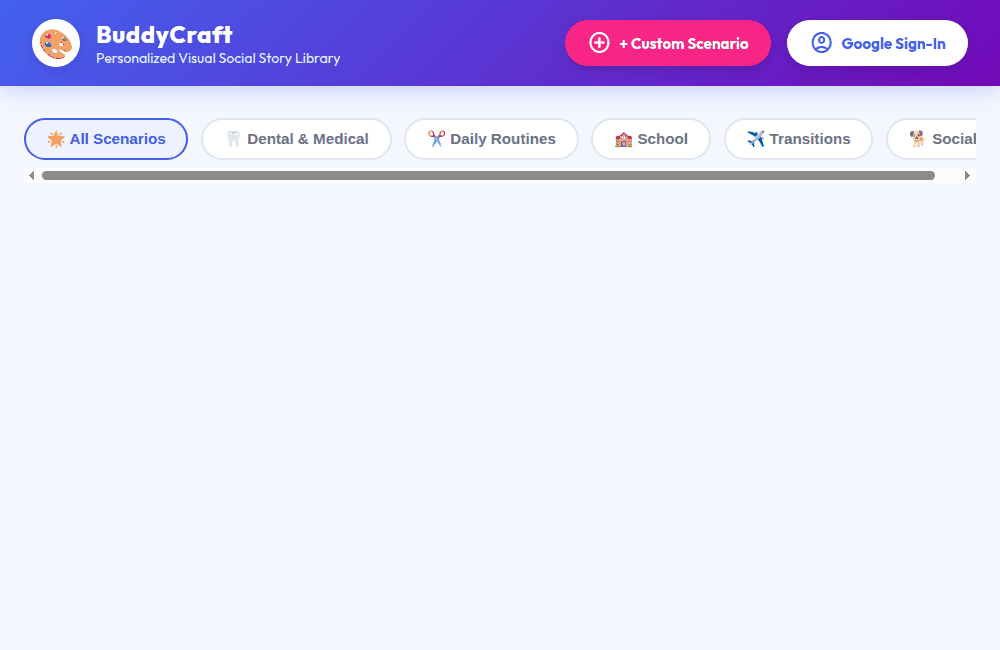

# BuddyCraft — Personalized Visual Social Story Agent 🎨

> **Personalized Visual Social Story & Routine Builder for Neurodivergent and Special Needs Children.** Built with Google Agent Development Kit (ADK) and deployed on Google Cloud Vertex AI Agent Runtime.



---

## 🌟 Overview

**BuddyCraft** is a compassionate, assistive AI agent designed to help parents, educators, and occupational therapists create personalized visual social stories and daily routine cards for children with Autism Spectrum Disorder (ASD), sensory sensitivities, and developmental needs.

By adhering to Carol Gray's evidence-based Social Story principles, BuddyCraft generates positive, low-anxiety narratives paired with custom 2D cartoon illustrations, visual step countdowns, and token reward trackers.

---

## 🛠️ Implemented Architecture & Google Cloud Services

BuddyCraft is powered by Google Agent Development Kit (ADK) and integrates the following Google Cloud services and tools:

| Service / Capability | Implementation Details | Function / Tool |
| :--- | :--- | :--- |
| **LLM Reasoning** | `gemini-2.5-flash` | Core agent reasoning, Carol Gray story structuring, empathetic tone |
| **Long-Term Memory** | Vertex AI Memory Bank | `PreloadMemoryTool` — Remembers child preferences, comfort items, and sensory triggers across sessions |
| **Database Storage** | Google Cloud Firestore | `manage_family_profile`, `save_social_story` — Custom child/caregiver profiles with in-memory fallback |
| **Image Storage** | Google Cloud Storage (GCS) | Media bucket storing 2D cartoon assets with base64 Data URI inline fallback |
| **Multimodal Image Gen** | `gemini-3.1-flash-lite-image` | `generate_cartoon_illustration`, `generate_comic_book_page` — 2D cartoon avatars & 4-panel comic pages |
| **Therapeutic RAG** | Vertex AI RAG Engine | `consult_ot_guidance` — Grounded occupational therapy & speech-language transition techniques |
| **Code Execution** | Agent Engine Sandbox | `calculate_routine_timer` — Step duration math and visual token economy calculations |
| **Rich UI Rendering** | A2UI Visual Cards | `after_model_callback` (`a2ui_callback`) — High-contrast story cards, reaction tiles, and comic panel grids |

---

## 🚧 Status of Planned Features

- [x] Personalized social story generation with Carol Gray guidelines
- [x] 4-panel cartoon comic book page generation (`generate_comic_book_page`)
- [x] Child and caregiver family profile customizer
- [x] Occupational Therapy (OT) transition guidance grounding
- [x] Visual timer and token economy tracker
- [ ] *Planned, not yet implemented*: Real-time audio voice narration (Text-to-Speech export)
- [ ] *Planned, not yet implemented*: Direct PDF export for printing physical social story booklets

---

## 📁 Repository Structure

```
social-story-agent/
├── app/
│   ├── agent.py               # Main ADK Agent definition and system instructions
│   ├── family_tools.py        # Firestore family profile & story management
│   ├── image_tools.py         # Gemini image generation & 4-panel comic page builder
│   ├── rag_tools.py           # Vertex AI RAG Engine OT guidance lookup
│   ├── timer_tools.py         # Sandbox code execution for visual routine timers
│   └── a2ui_utils.py          # A2UI response formatting callback
├── frontend/
│   ├── main.py                # FastAPI proxy connecting UI to agent over A2A protocol
│   └── static/
│       └── index.html         # Kids-friendly web UI & A2UI card renderer
├── agents-cli-manifest.yaml   # Agents CLI deployment configuration
├── GEMINI.md                  # Development instructions & guidelines
└── pyproject.toml             # Python dependencies
```

---

## 🚦 Local Setup & Running Instructions

### Prerequisites
- Python 3.10+
- `google-agents-cli` (`uv tool install google-agents-cli`)
- Google Cloud SDK authenticated with Vertex AI access (`gcloud auth application-default login`)

### 1. Install Dependencies
```bash
agents-cli install
```

### 2. Start Local Agent Playground
To run the ADK developer playground locally:
```bash
agents-cli playground
```

### 3. Start the Web Frontend Proxy
To launch the kids-friendly web UI locally:
```bash
cd frontend
python main.py
```
*(Access the web interface by navigating to `0.0.0.0:8080` in your browser.)*

---

## 🧪 Testing

Run unit and integration tests using pytest:
```bash
uv run pytest tests/unit tests/integration
```
