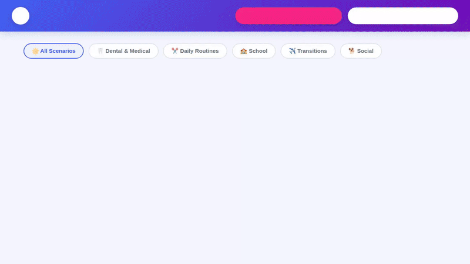

# BuddyCraft — Visual Social Story & Routine Agent 🎨

> **Personalized Visual Social Story & Routine Builder for Neurodivergent and Special Needs Children.** Built with Google Agent Development Kit (ADK) and deployed on Google Cloud Vertex AI Agent Runtime.



> 📹 **Video Demo**: Watch the full high-definition video demonstration in [`docs/demo.mp4`](docs/demo.mp4).

---

## 🌟 Overview

**BuddyCraft** is an assistive AI agent designed to help parents, educators, and occupational therapists create personalized visual social stories and daily routine cards for children with Autism Spectrum Disorder (ASD), sensory sensitivities, and developmental needs.

Adhering to Carol Gray's evidence-based Social Story principles, BuddyCraft generates positive, low-anxiety narratives paired with custom 2D cartoon comic pages, visual step countdowns, and token reward trackers.

---

## 🛠️ Implemented Architecture & Google Cloud Services

BuddyCraft is powered by Google Agent Development Kit (ADK) and integrates the following Google Cloud services and tools implemented directly in `app/`:

| Service / Capability | Implementation Details | Function / Tool |
| :--- | :--- | :--- |
| **LLM Reasoning** | `gemini-2.5-flash` | Core agent reasoning, Carol Gray story structuring, empathetic tone |
| **Long-Term Memory** | Vertex AI Memory Bank | `PreloadMemoryTool` — Remembers child preferences, comfort items, and sensory triggers across sessions |
| **Database Storage** | Google Cloud Firestore | `manage_family_profile`, `save_social_story` in [`family_tools.py`](file:///config/Desktop/social-story-agent/app/family_tools.py) — Manages child profiles and saved stories |
| **Image Storage** | Google Cloud Storage (GCS) | Media bucket (`social-story-media-qwiklabs-gcp-02-1f7e291be017`) storing generated comic JPEG pages |
| **Multimodal Image Gen** | `gemini-3.1-flash-lite-image` | `generate_cartoon_illustration`, `generate_comic_book_page` in [`image_tools.py`](file:///config/Desktop/social-story-agent/app/image_tools.py) — Generates 2D cartoon artwork and 4-panel composite comic pages with clothing character name prints |
| **Therapeutic RAG** | Vertex AI RAG Engine | `consult_ot_guidance` in [`rag_tools.py`](file:///config/Desktop/social-story-agent/app/rag_tools.py) — Grounded occupational therapy (OT) and speech transition guidance with fallback rules |
| **Code Execution** | Agent Engine Sandbox | `calculate_routine_timer` in [`timer_tools.py`](file:///config/Desktop/social-story-agent/app/timer_tools.py) — Step duration math and visual token economy calculations |
| **Rich UI Rendering** | A2UI Visual Cards | `after_model_callback` (`a2ui_callback`) in [`a2ui_utils.py`](file:///config/Desktop/social-story-agent/app/a2ui_utils.py) — High-contrast story cards, reaction tiles, and comic panel grids |

---

## 🚧 Status of Planned Features

- [x] Personalized social story generation with Carol Gray guidelines
- [x] 4-panel cartoon comic book page generation (`generate_comic_book_page`)
- [x] Subtitled 1-page comic cards with character names printed on T-shirts/clothing
- [x] Child and caregiver family profile management in Firestore (`manage_family_profile`)
- [x] Occupational Therapy (OT) transition guidance grounding (`consult_ot_guidance`)
- [x] Visual timer and token economy tracker (`calculate_routine_timer`)
- [ ] *Planned, not yet implemented*: Real-time audio voice narration (Text-to-Speech export)
- [ ] *Planned, not yet implemented*: Direct PDF export for printing physical social story booklets

---

## 📁 Repository Structure

```
social-story-agent/
├── app/
│   ├── agent.py               # Main ADK Agent definition and system instructions
│   ├── family_tools.py        # Firestore family profile & story management
│   ├── image_tools.py         # Gemini image generation & Pillow 4-panel comic page builder
│   ├── rag_tools.py           # Vertex AI RAG Engine OT guidance lookup
│   ├── timer_tools.py         # Sandbox code execution for visual routine timers
│   └── a2ui_utils.py          # A2UI response formatting callback
├── frontend/
│   ├── main.py                # FastAPI server & GCS static image proxy
│   └── static/
│       └── index.html         # Visual Social Story Gallery & Lightbox Viewer UI
├── agents-cli-manifest.yaml   # Agents CLI deployment configuration
├── GEMINI.md                  # Development instructions & guidelines
└── pyproject.toml             # Python dependencies
```

---

## 🚀 Infrastructure Dependencies & Setup

### Explicit GCP Service & Resource Dependencies

BuddyCraft relies on the following Google Cloud infrastructure components:

| Dependency Type | Component / Service | Purpose | Required IAM / Config |
| :--- | :--- | :--- | :--- |
| **GCP APIs** | `aiplatform.googleapis.com` | Vertex AI Agent Runtime, Reasoning Engines, Memory Bank | API Enabled |
| **GCP APIs** | `storage.googleapis.com` | Google Cloud Storage media asset hosting | API Enabled |
| **GCP APIs** | `firestore.googleapis.com` | Cloud Firestore database for family profiles & saved stories | API Enabled |
| **GCP APIs** | `logging.googleapis.com` | Structured logging and diagnostic telemetry | API Enabled |
| **GCP APIs** | `secretmanager.googleapis.com` | API key and credential management | API Enabled |
| **GCP APIs** | `cloudbuild.googleapis.com` | Container image builds for Agent Runtime | API Enabled |
| **GCP APIs** | `run.googleapis.com` | Serverless container execution target | API Enabled |
| **Storage Bucket** | `gs://social-story-media-${PROJECT_ID}` | Stores generated cartoons, comics, and video mp4s | Public object read (`roles/storage.objectViewer`) & CORS enabled |
| **Database** | Cloud Firestore Native Database | Persists family profiles and social story records | Native Mode initialized, `roles/datastore.user` |
| **IAM Service Account** | `service-${PROJECT_NUMBER}@gcp-sa-aiplatform-re.iam.gserviceaccount.com` | Agent Runtime execution account | `roles/storage.objectAdmin`, `roles/datastore.user`, `roles/logging.logWriter` |

---

## 🛠️ Automated Infrastructure Provisioning & Deployment

### 1. Provision Prerequisites
Run the prerequisite script to automatically enable all required GCP APIs, provision the media storage bucket, set CORS policies, initialize Firestore, and configure IAM permissions:

```bash
./scripts/setup_prereqs.sh <PROJECT_ID> [REGION]
```

### 2. Run Automated Deployment
The unified deployment script runs prerequisite validation, executes the `pytest` suite, and deploys the agent to Vertex AI Agent Runtime:

```bash
./scripts/deploy.sh <PROJECT_ID> [REGION]
```

---

## 💻 Local Setup & Running Instructions

### Prerequisites
- Python 3.11+
- `google-agents-cli`
- Google Cloud SDK authenticated with Vertex AI & Firestore permissions (`gcloud auth application-default login`)

### 1. Install Dependencies
```bash
uv sync
```

### 2. Start the Local Server
Launch the FastAPI app and web interface:
```bash
uv run python frontend/main.py
```

---

## 🧪 Testing

Run unit and integration tests using pytest:
```bash
uv run pytest tests/
```
